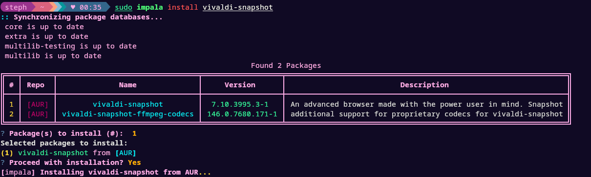
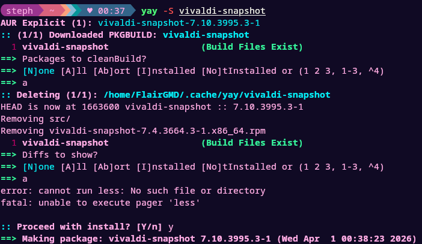
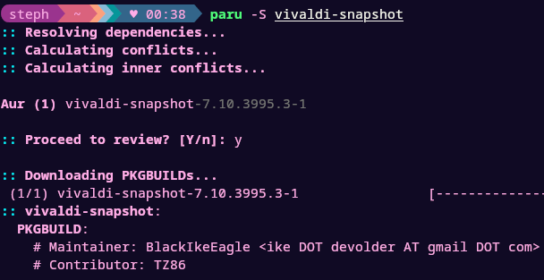
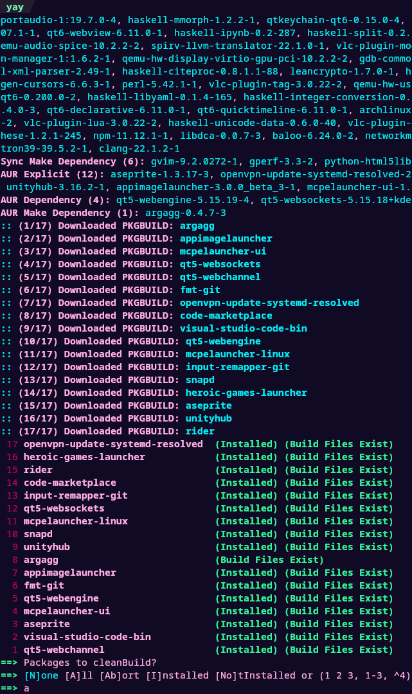

# IMPALA

**Intelligent Manager for Packages, AUR, and Local Archives** - A user-friendly AUR helper written in Python <br><small> *(or: yet another (almost) Instant AUR helper for Managing Packages And helping users navigate Linux cli tools. Amen.)*

 <br>
 <br>

## Features

- User friendly UX designed with beginners in mind, without sacrificing the comfort of advanced users:
  - Plain English commands, not flags. `install` instead of `-S`, `remove` instead of `-Rs`
  - Package lists are output as concise tables including all package information.
  - Pretty text formatting using Rich, pretty confirmation prompts using Questionary.
- Narrow search with keywords (`impala install zen browser` searches for `zen` and then filters out packages without `browser`)
- Search repositories from pacman.conf along with the AUR.
- Automatically install dependencies required to build packages

## System requirements

### Operating system

Arch Linux, or any Arch Linux based distribution

### Installed packages

IMPALA requires the following packages to be installed:

- `git`
- `base-devel`
- `python` version 3.8 or higher
- `pip` (can be uninstalled after IMPALA is built)

## Installation

### From the AUR (recommended)

COMING SOON: IMPALA has not yet been submitted to the AUR/is awaiting approval. This readme will be updated once installing from the AUR is viable.

### From PyPI

You can install IMPALA from PyPI with the following command:
```bash
pip install impala-aur-helper
```

View IMPALA on PyPI at: https://pypi.org/project/impala-aur-helper

### From source

IMPALA can be installed from source in two ways:

#### Using makepkg (recommended)

IMPALA can be installed by running the following commands:

```bash
git clone https://github.com/tildes1lly/IMPALA.git
cd IMPALA
makepkg -si
```

If you'd like to chain them all together, you can do so as well:

```bash
git clone https://github.com/tildes1lly/IMPALA.git && cd IMPALA && makepkg -si
```

#### Using pip

IMPALA can be installed with pip using the following commands:

```bash
git clone https://github.com/tildes1lly/IMPALA.git
cd IMPALA
pip install .
```

If you'd like to chain them all together, you can do so as well:

```bash
git clone https://github.com/tildes1lly/IMPALA.git && cd IMPALA && pip install .
```

## Usage

### Commands

#### Install

`impala install <keywords>`<br>**Searches the AUR and repositories for matching packages and asks the user which package(s) to install.**<br>Example: `impala install firefox`

#### Remove

`impala remove <keywords>`<br>**Searches for installed packages matching keywords and asks the user which package(s) to uninstall**<br>Example: `impala remove firefox`

#### Upgrade/Update

`impala upgrade` or `impala update`<br>**Upgrades all packages that are out of date.**<br>Example: `impala upgrade`

## Impala vs. [yay](https://github.com/Jguer/yay) and [paru](https://github.com/Morganamilo/paru)

### User Interface

#### Package installation

##### yay:<br>

 <br>

##### paru:<br>

 <br>

##### IMPALA:<br>

 <br>

#### System upgrades

##### yay:<br>

 <br>

##### paru:<br>

 <br>

##### IMPALA:<br>

 <br>

#### Note

**NOTE: IMPALA focuses on user experience as opposed to yay and paru. yay and paru may be better for advanced users.**

### Bad PKGBUILD: Waterfox

**NOTE: Waterfox has a bad PKGBUILD as of this being written. That is why Waterfox was chosen for a comparison. The AUR helpers are all expected to fail here, the comparison is how long they'll take before erroring out of a bad PKGBUILD** <br>

[https://github.com/tildes1lly/IMPALA/raw/main/README_media/comparison.mp4](https://github.com/user-attachments/assets/b0057a5b-c293-4d64-be0f-278404fde13e)

**NOTE: This video contains speed changes, as if it didn't it would be 13 minutes long.**
<br>
If you don't want to watch the video: IMPALA & paru perform similarly (paru: 15s, IMPALA: 25s) while yay falls behind taking 11 minutes before failing.

### Note

These comparisons are all made in good faith. This project was heavily inspired by yay and paru and much love goes towards their developers. yay and paru objectively have more features than IMPALA; if you are a power user, they are probably better for your needs.

## Contributing

If you want to contribute to IMPALA, create a fork fixing an [issue](https://github.com/tildes1lly/impala/issues) or adding a feature. Then, open a pull request.<br><small>For monetary contributions, see [Supporting IMPALA](#supporting-impala).</small>

## License

IMPALA is licensed under GNU GPL 3.0.

## Supporting IMPALA

[](https://ko-fi.com/V7V71WWUDA)
